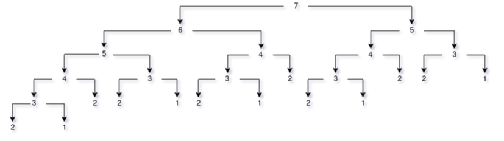

Durante o decorrer deste trabalho, os exemplos utilizados para demonstrar o paradigma funcional foram feitos em [Haskell](https://www.haskell.org/), que podem ser escritos em arquviso `.hs` e rodados com o [Glasgow Haskell Compiler (GHC)](https://www.haskell.org/downloads/) no computador. Caso decida utilizar o `ghc` lembre-se de salvar o código em um `*.hs` pois a ferramenta servirá de compilador para ele, caso decida utilizar o REPL da linguagem, o GHCi, não coloque o header da função -- a linha que vem logo em cima da função com a tipagem explicitada -- e, além disso, rode a função puramente, sem o uso da função `main`. Há também uma alternativa online para rodar tais exemplos, o [repl.it](https://repl.it/languages/haskell), nesse caso você deverá copiar e colar o código sem nenhuma alteração e clicar no botão `run` presente no site.

Tal linguagem fora escolhida devido a facilidade, conhecimento prévio dela e por se tratar de uma implementação pura do paradigma funcional. Mas outras linguagens merecem ser citadas antes de se prosseguir:

- [Closure](https://clojure.org/)
- [LISP](https://lisp-lang.org/)
- [F#](https://fsharp.org/)
- [Elixir](https://elixir-lang.org/)
- [Erlang](https://www.erlang.org/)

A curiosidade sobre Elixir é que seu criador é o brasileiro José Valim. Já sobre [Haskell](#haskell), que será explicada com maior detalhes mais para frente; um comentário sobre ela em uma questão sobre seus prós e contras no [StackOverflow](https://stackoverflow.com/a/1695080/7092954) pontua um contra que, em tradução livre, seria:

_"Aprender Haskell irá arruinar todas as outras linguagens para você."_

Brincadeiras a parte, Haskell é uma linguagem muito bem vista na comunidade de linguagens funcionais pois ser referenciada por sua "pureza" de implementação do paradigma, ela está para Funcional como [Smalltalk](https://squeak.org/) está para Orientado a Objetos.

Por um simples motivo de diferenciar o trabalho apresentado aqui, foi utilizado a notação prefixada de operadores ao invés de seu equivalente infixado.

## Noções Básicas
Assim como os outros paradigmas de computação como: Orientado a Objetos, Lógico, Imperativo e etc; Funcional se trata de um conjunto de regras nas quais as linguagens que se propoem a implementar eles devem seguir. Muitas vezes essas mesmas linguagens implementam multiplos paradigmas como, por exemplo, [JavaScript](https://www.javascript.com/) e outras, que implementam só um, são chamadas de "puras", assim como Haskell. Então é importante saber diferenciar se uma linguagem segue à risca um paradigma à risca antes de criticar ele ou a própria linguagem.

Como o nome pode indicar, o paradgima funcional tem como "unidade mínima" a função. Dito isso, funções à parte, quais são as regras que o paradgima propõe?

### Imutabilidade
Imutabilidade funciona como uma regra que diz que uma função pura não deve ser rodada para chamadas subsequentes uma vez que já foi chamada com os mesmo parâmetros anteriormente. Dada a a função `addTwo`:
```haskell
addTwo :: Integral a => a -> a -> a
addTwo a b = (+) a b

main :: IO()
main = do
    print $ addTwo 1 2
```

Se seu equivalente fosse implementado em uma linguagem não funcional ou até mesmo que seja multiparadgima -- sendo ela "não pura" -- como JavaScript, seria algo do tipo:
```javascript
const addTwo = (a, b) => a + b;

addTwo(1, 2);
```
Na prática as duas realizarão a mesma conta se passado os valores 1 e 2 como paramêtros, todavia, em chamadas subsequentes da mesma função com os mesmos valores, a implementação em JavaScript irá recalcular o valor, fazendo novamente a operção `1 + 2`, diferentemente da implementação feita em Haskell que simplesmente irá retornar `3` direto.

A imutabilidate não é apenas válidas para funções mas também para variáveis, ou seja, uma vez que uma "variável" recebe um valor, ela não pode mudar mais ele -- okay, se você já conhece Haskell ou outras linguagens, sabe do uso do `let`, mas ele não torna a função ou variável imutável ou até mesmo [pura](#pureza) --; então o seguinte código retornaria um erro durante a compilação:
```haskell
main :: IO()
main = do
    foo = 1
    foo = 2
    print $ foo
```

O GHC pegaria a segunda atribuição de `foo` e a marcaria como inválida, não permitindo a execução do programa. Por essas e outras as variáveis possuem outro nome em linguagens funcionais, **constantes**.

Para aqueles mais familiares com outras linguagens que permitem processos simalares, pode conhecer isso como [memoization](https://en.wikipedia.org/wiki/Memoization); técnica essa que pode também ser implementada a nível de hardware.

Cenários asssim que representam a vantagem da imutabilidade. Tendo isto em mente, há casos que realmente o valor de retorno pode varia dado há uma conexão de internet, banco de dados ou até mesmo leitura de arquivos, casos assim são conhecidos por gerarem [efeitos colaterais](#efeitos-colaterais).

#### Efeitos colaterais
Efeito colateral é o nome dado há toda chamada de um programa para serviços que se encontram fora do seu escopo -- "fora da memória" -- como, por exemplo, um serviço de autenticação de usuários. Digamos que um código de login feito em Haskell tenha que fazer uma requisição através da internet, uma função chamada `auth` recebe dois parametros, usário e senha. Digamos que em uma sessão que dure 15min o usário tenha que se reconectar, só que coincidentemente a senha dele expirou, mesmo que ele digite o mesmo usuário e a mesma senha do primeiro login, não será reconectado; isso tudo porque é uma chamada há um seviço do qual o programa não possui controle.

Outro exemplo seria uma função que utiliza um número randomico, no qual para cada chamada dela, mesmo que seja uma função [pura](#pureza), como um dos seus argumentos não é dependente de um comportamento fora do programa -- normalmente uma chamada ao horário e dada do sistema no qual o número randomico é calculado em cima --, isso quebrará a [imutabilidade](#imutabilidade), gerando o efeito colateral.

Em suma, efeitos colaterais são comportamentos não esperados por uma aplicação. Isso pode ficar mais claro uma vez que [lambda cáculo](#lambda-c%C3%A1culo) for apresentado.

Empresas como o [Nubank](https://nubank.com.br/) utilizam um padrão de se colocar um ponto de exclamação no nome da função para indicar para o programador que a função que ele está utilizando possui efeitos colaterais e permite com que a lógica a partir desse ponto possa ser refatorada para se levar isso em conta.

### Pureza
A ideia de pureza muitas vezes é dada como sinônimo para [imutabilidade](#imutabilidade),só que ela é mais simples e pode ser implementada mesmo em linguagens não funcionais. Basicamente a pureza representa funções que, para funcionar, dependem apenas de seus argumentos e parametros passados para elas; ou seja, nada de variáveis globais -- seja para lê-las ou alterá-las -- e, além disso, a função não deverá alterar os valores de seus parametros.

Ou seja, a seguinte função, em JavaScript, é considerada pura pois apenas depende de seus parametros:
```javascript
const powerOf = (a, b) => a ** b;
```

Como funções puras podem sim causar [efeitos colaterais](#efeitos-colaterais), uma não excluí a outra. Além disso, não existem funções `void` ou seja, uma função deverá **SEMPRE** retornar algo; este ponto é bem importante uma vez que linguagens como F# não possuí uma das características mais típicas de linguagens de computação independentemente do paradigma, o `NULL`. Essa falta dessa característica é diretamenta relacionada ao fato de que nulo não é um valor em si, mas sim um estado; como o paradigma reinforça o uso de constantes, um estado é algo que vai contra isso pois indica que algo pode mudar seu valor e se o valor muda não é mais uma constante e sim uma variável.

Todas essas aparentes "restrições" que pureza impõe acabam tornando na verdade o código mais simples de se entender:
```haskell
global :: Integral
global = 0

overwrittingParameter :: Integral
overwrittingParameter a = where
    a = (+) a a
    global = (+) global global

main :: IO()
main = do
    print $ overwrittingParameter 1
```

Este exemplo não será compliado pois:

- O parametro `a` está sendo sobrescrito;
- `global` é um valor que não é argumento de `overwrittingParameter`;
- Mesmo se não fosse pelos itens anteriores, `overwrittingParameter` não funcionaria pois não retorna nenhum valor pois o bloco `where` começa logo em seguida.

Esse cenário é tão absurdo que um ambiente de desenvolvimento com plugins para Haskell apresentaria todas essas inconsistências durante o processo de escrita do código.

### Composição de Funções
Na matemática vista no ensino básico é ensinado composição de funções, na qual uma função redireciona seu resultado como entrada para outra:
$$f(x) = x + 1$$
$$g(y) = y * 2$$
$$f(g(y)) = f \circ g(y) = (y * 2) + 1$$
$$g(f(x)) = g \circ f(x) = (x + 1) * 2$$

Em linguagens funcionais o mesmo pode ser alcançado através de operadores que desempenham o mesmo. Exemplo:
```haskell
isEven :: Integer -> Bool
isEven a = (==) (mod a 2) 0

main :: IO()
main = do
    print $ isEven 10
    print $ (not . isEven) 10
```

No caso de Haskell tal operador é dado através do ponto mesmo, ao invés de se criar uma função `isOdd` o mesmo pode ser realizado para esse caso ao se compor o `not` com a função `isEven` uma vez que todo número par não é um número ímpar, basta verificar-se se um número é par e negar seu resultado para obter-se se o mesmo é ou não um número ímpar.

### Funções de Alta Ordem
Talvez o conceito mais vangloriado em apresentações sobre linguagens funcionais e também um dos que mais define a simplicidade e ideia do paradigma, basicamente ele representa duas coisas:

- Pode receber funções como parametros
- Pode retornar funções
- São considerados "cidadãos de primeira classe"

Essa ideia será melhor exemplificada durante o resto do trabalho, inclusive começando no próximo tópico, as [funções anonimas](#fun%C3%A7%C3%B5es-anonimas).

### Funções Anonimas
Também conhecidas como funções lambdas, hoje em dia liguangens que não são necessariamente multi-paradigmas como [C#](https://docs.microsoft.com/en-us/dotnet/csharp/programming-guide/) e [Java](https://www.oracle.com/java/) implementam ela. Funções anonimas são "funções sem nome".

Elas são geralmente utilizadas ao se passar uma função por parametro, como a parte da maneira [sem loop](#sem-loops) mostra, só que também podem ser utilizadas em [closures](#closures) demonstram. Um exemplo simples que trabalha em cima da ideia de composição de funções será dado em seguida -- não é um exemplo muito prático mas serve para clarificar a ideia:
```haskell
squareAndMultiplyByTwo :: Num a => (a -> a) -> (a -> a) -> a -> a
squareAndMultiplyByTwo first second value = (second . first) value

main :: IO()
main = do
    print $ squareAndMultiplyByTwo (\x -> (**) x x) (\y -> (*) y 2) 2
```

A função `squareAndMultiplyByTwo` recebe três parametros:

- first: uma função que recebe um valor e retorna o seu quadrado
- second: uma função que recebe um valor e retorna o seu dobro
- value: um valor
  
A função `first` será excutada primeiro e o seu valor calculado servirá como input para a função `second`, isso é mostrado pela composição demonstrada. O valor passado em `value` que servirá de input para a primeira função. Com a [notação de ponto livre](#nota%C3%A7%C3%A3o-de-ponto-livre) que será vista a seguir, há como melhorar ainda mais essa escrita de função.

### Notação de ponto livre
É uma maneira de compor funções sem expecificar seus argumentos.

Como pode é mostrado nos exemplos em Haskell até agora, as funções possuem um "header" com seu nome e os tipos de dados que recebem e retornam; essa informação não é necessária uma vez que o compilador é autossuficiente para inferir elas. Só que, por causa delas, a notação de ponto livre pode ser melhor explicada:
```haskell
addFive :: Num a => a -> a
addFive x = (+) x 5

multiplyByTwo :: Num a => a -> a
multiplyByTwo y = (*) y 2

addFiveAndMutplityByTwo :: Num a => a -> a
addFiveAndMutplityByTwo = addFive . multiplyByTwo

main :: IO()
main = do
    print $ addFiveAndMutplityByTwo 1
```

Como a função `addFiveAndMutplityByTwo` é formada pela composição de outras duas, `addFive` e `multiplyByTwo`, seus parametros não precisam ser explicitados pois ela "herda" a definição da composição pela qual é formada; o que a torna menos verbosa e reduz redundâncias.

### Recursão
Recursão é o ato de uma função chamar ela mesma, para isso a função em si deve ter uma condição de parada -- uma característica na qual ela irá de parar de fazer chamadas a ela mesma --, isso por si só não é uma característica de linguagens funcionais uma vez que é uma característica de linguagens de programação em si.

#### Sem loops
"Sem loops" é uma afirmação muito pesada para ser generalizada, mas linguagens funcionais  pelo menos desencorajam o uso de estruturas comuns em percorrer estuturas como `for` ou `while` que são comuns em outras linguagens -- até mesmo o `do ... while ` --, uma vez que elas não seguem um lema funcional de: _"se preocupe com a forma mas sim a com a ideia"_, ou seja, ao invés de se preocupar em como se deve percorrer uma estrutura, se preocupe em como a ideia do que fazer com cada elemento da estrutura.

Ao invés de utilizar essas maneiras mais tradicionais de outras linguagens, algumas outras maneiras de se percorrer arrays ou listas são as apresentadas a seguir.

##### Map
Mapear um array é o ato de percorrer um array e realizar operações com cada um de seus elementos retornando um novo array com esses novos valores nele:
```haskell
main :: IO()
main = do
    print $ map (+1) [1..10]
```

Nesse caso, o `map` irá percorrer cada um dos valores do array de um a dez e adicionar um valor à eles, retornando um novo array `[2, 3, 4, ..., 11]`.

##### Filter
Como o nome pode indicar, filtra os valores de um array dada uma condição, retornando os valores em um novo array:
```haskell
main :: IO()
main = do
    print $ filter (\x -> (==) 0 (mod x 2)) [1..10]
```

Já, neste caso, apenas os valores pares dentro do array serão retornados, ou seja, `[2, 4, 6, ..., 10]`.

##### Reduce
"Reduzir" um array é o equivalente a percorrer ele aplicando uma operação a cada um de seus elementos e acumular esse valor em uma variável a ser retornada. No exemplo seguinte é utilizada a função `foldl` que é uma das implementações do reduce em Haskell, ela será utilizada para somar todos os valores de um array:
```haskell
main :: IO()
main = do
    print $ foldl (+) 0 [1..10]
```

A função recebeu três paramentros, o primeiro é a função a ser utilizada, o segundo é o valor inicial e o terceiro é o array a ser percorrido. O zero do segundo parametro serve como o valor a ser dado durante a primeira operação de soma, ele não pode fazer sentido em uma função de soma, mas caso se fosse uma multiplicação um outro fator poderia ser aplicado.

A diferença tradizda por `foldl` pode ser gritante em outros "reduces" de outras linguagens, ainda mais quando não se sabe o limite do array, o que pode ser aplicado principalmente em Haskell em [verificações não estritas](#verifica%C3%A7%C3%B5es-n%C3%A3o-estritas). Outra diferença é que existe um `foldr` que pode ser visto no apendice [foldl vs foldr](#foldl-vs-foldr).

### Currying
Currying é a técnica de aplicar-se parcialmente uma função, aplicando-se mais de duas funções sendo que cada uma aceita **UM** parametro e retorna **UM** resultado, permitindo a ilusão de uma função de multiplos parametros:
```haskell
addTwo :: Num a => a -> a -> a
addTwo x y = (+) x y

partialAdd :: Num a => a -> a -> a
partialAdd x = addTwo x

main :: IO()
main = do
  let partialAdded = partialAdd 5
  print $ partialAdded 2
```

Como a constante `y` da função `addTwo` não sofreu um binding na em `partialAdd`, ela continuou solta ao ser invocada a função em `partialAdded`, constante `y` sofreu o binding nela, então quando ela é invocada com o valor 2, o valor apresentado na tela é 7 uma vez que o cinco já havia sido atrelado à constante `x` anteriormente.

### Closures
Closures são funções que retornam outras funções, ou seja, fazem parte das [funções de alta ordem](#fun%C3%A7%C3%B5es-de-alta-ordem), só que, além disso, elas também guardam em si valores das sua primeira chamada para ser utilizado em chamadas subsequentes. Exemplo:
```haskell
powerOf :: Integer a => a -> (\a -> a)
powerOf x = (\y -> y ^ x)

powerOfTwo :: Integer a => a -> a
powerOfTwo y = powerOf y 2

powerOfThree :: Integer a => a -> a
powerOfThree y = powerOf y 3

main :: IO()
main = do
    print $ powerOfTwo 2
    print $ powerOfTwo 3
    print $ powerOfThree 2
```

Nesse caso a função `powerOf` recebe, em sua primeira chamada, um número para servir de expoente para futuras chamadas; já as funções `powerOfTwo` e `powerOfThree` são derivadas dela com o expoente fixados, elas só recebem valores diferentes para servir de base. Ou seja, os valores que serão mostrados são os seguintes:
```shell
4
9
8
```

Após essa explicação, a diferença entre closures e [currying](#currying) pode ter ficado mais clara, mas caso não tenha ficado, só pensar que closure trata-se de uma aplicação de composição de funções sem [variáveis livres](#vari%C3%A1veis-livres), enquanto currying possuí tais variáveis livres em seu contexto.

### Estruturas de controle
Programas seguem fluxos de controle e o paradigma funcional possui maneira de estruturar eles.

#### Ternário
O famoso `if ... then ... else ...`. Diferentemente de outros paradigmas, o funcional não implementa a possibilidade de declarar vários `if` seguidos como outros permitem, isso tem a ver com o lema de uma função ser um valor e não uma sequencia de expressões. Então para evitar "decisões" a serem tomadas dentro de um contexto, a função é reduzida a tomar duas decições apenas:
```haskell
main :: IO()
main = do
    print $ if 5 > 4 then "greater" else "lesser"
```

Neste caso `"greater"` aparecerá no terminal.

A ideia em si não é nova para linguagens de computação, mas sua limitação sim uma vez que os outros meios de controlar o fluxo de execução de um programa supre essas necessidades.

#### Guards
Expandindo a ideia de que funções são valores e que elas podem "variar" de acordo seu parametros, guards servem para poder representar tal comportamento:
```haskell
value :: Integer -> [Char]
value n
    | (>) 0 n = "negative"
    | (==) 0 n = "zero"
    | otherwise = "positive"

main :: IO()
main = do
    print $ value 2
```

Neste caso, `"positive"` será apresentado no terminal da aplicação, uma vez que o valor foi comparado com 0 e não é menor ou igual a zero; a flag do `otherwise` irá rodar e dar a match com o valor necessário para esse caso.

#### Pattern Matching
Linguagens funcionais por padrão não possuem switch cases, para emular o seu comportamento, _pattern matching_ são disponibiliazdos. Eles não são únicos do paradigma funcional, o paradigma lógico também os possuí; a ideia por trás deles é tratar a função de maneira diferente de acordo os seus inputs.
```haskell
myTake :: Int -> [a] -> [a]
myTake 0   _    = []
myTake _   []   = []
myTake n (x:xs) = x : take ((-) n 1) xs

main :: IO()
main = do
    print $ myTake 2 [1..10]
```

Neste caso, `myTake` implementa uma funcionalidade de retirar _n_ valores de um array e retornar eles em um novo array -- uma vez que [imutabilidade](#imutabilidade) impede de se alterar o array passado como parametro, um novo deverá ser criado para armazenar uma cópia dos valores contidos na fonte --; neste caso, cada uma declaração da função possui os seguintes comportamentos:
1. Caso seja para retirar nenhum valor, retorne um array;
2. Caso o array seja vazio, retorne um array vazio;
3. Caso `n` elementos sejam necessários, pegue o primeiro e depois chame a [recursivamente](#recurs%C3%A3o) para retirar os outros `n - 1` elementos.

##### Wildcard
Caso o `_` na declaração da função da função tenha sido díficil de se interpretar para entender o que ele faz, simplesmente é um placeholder que indica ao compilador para não se preocupar com aquela constantes em si, ela vai estar lá porque Haskell é uma linguagem que se orienta pela posição das constantes do que pelo seu nome. E nos casos demonstrados quando o valor da posição não é o importante, o tamanho o array era e vice-versa.

### Não mencionados
Alguns artigos citam os seguintes temas como fazendo parte do core do paradigma:

- Modularidade
- Mantenabilidade
- Performance

Todavia é pouco provável pensar em um paradigma que não vise eles, seja funcional ou não. Assim sendo tais temas são muito mais colocados para inflar o paradigma e vender uma ideia de um _"jack for all trades"_ -- um canivete suíço que irá resolver todo e qualqer problema.

Funcional ou não os paradigmas tem o seu contexto e sua maneira de ser escrito. Assim como alguns sites de comparadores de benchmarks de linguagens procuram escrever a mesma coisa em linguagens diferentes com sotaques -- "paradigmas" -- muitas vezes não nativos à elas, linguagens como [Scala](https://scala-lang.org/) que não é puramente funcional acabam perdendo sua performance quando comparadas às outras por estar rodando em um estado "não natural". O apêndice sobre o [ressurgimento](#ressurgimento-de-funcional) do paradigma cobre um pouco e aprofunda esses pontos.

## Lambda cáculo
Antes de se explicar mais sobre [Haskell](#haskell), um tópico importante a se expor é que a linguagem foi feita baseando-se muito na lógica matemática por trás do lambda cáculo -- também representado por λ.

Trata-se de uma maneira de representar instruções reduzidas de um problema, fundamentado em alguns conceitos apresentados a seguir.

### Equivalência Alpha
Euivalência alpha é a representação de funções que realizam a mesma coisa de maneiras diferentes:
```
λx.x == λd.d == λz.z
```

### Redução Beta
Aplicação de um termo lambda para um argumento dntro de um corpo da abstração:
```
(λx.x)2         (λx.x+1)2+1         (λx.x)(λy.y)z
      2                 3          ((λx.x)(λy.y))z
                                    [x := (λy.y)]
                                    (λy.y)z
                                    [y := z]
                                     z

```
Aplicações no cáculo lambda são associativas à esquerda.

### Variáveis Livres
Variáveis que não são nomeadas no cabeçalho da função -- ao contrário de variáveis vínculadas:
```
λx.xy           (λx.xy)z
                (λ[x := z].xy)
                zy
```
[Equivalência alpha](#equival%C3%AAncia-alpha) não se aplica à variáveis livres.

### Argumentos múltiplos
Cada lambda pode apenas se vincularn a um parametro e pode aceitar apenas um argumento, isso é conhecido como [currying](#currying):
```
λxy.xy == λx(λy.xy)     λx.x            λxy.xy                  λxy.xy

                       (λx.x) 1        (λxy.xy) 1 2            (λxy.xy)(λz.a) 1
                       [x := 1]        (λx.(λy.xy)) 1 2        (λx(λy.xy))(λz.a) 1
                        1              [x := 1]                [x := (λz.a)]
                                       (λy.1y) 2               (λy(λz.a)y) 1
                                       [y := 2]                [y := 1]
                                        1 2                    (λz.a) *
                                                                a
```

### Combinadores
É um termo lambda sem [variáveis livres](#vari%C3%A1veis-livres):
```
λx.x
λxy.x
λxyz.x(yz)
```

Não são combinadores:
```
λy.x -- x is free
λx.xz -- z is free
```

### Divergência
São reduções de processos que não terminam nunca:
```
(λx.xx)(λx.xx)
[x := (λx.xx)]
(λx.xx)(λx.xx)
[x := (λx.xx)]
(λx.xx)(λx.xx)
     ...
(λx.xx)(λx.xx)
```

Isso é valido principalmente em programação porque termos que divergem não produzem uma resposta de um resultado significativo.

## Haskell
Haskell é famosa por:

- Enfatizar segurança
- Ser utilizada na indústria em na comunidade Open Source
  
Seu nome é dada em homengem à Haskell Curry, um matemático americano famoso pelo seu trabalho em lógica combinatória; tanto que o nome originalmente pensado a ser dado à linguagem era para ser Curry, mas após os desenvolvedores perceberem que já havia uma linguagem com esse nome decidiram mudar para Haskell.

Sua tipagem é do tipo forte -- do ponto de vista acadêmico, a força de uma linguagem é "o quão permissiva" sua tipagem pode ser --, além de ser estática e pode ser inferida. Tudo isso permite que erros de tipos são verificados durante a compilação e não a execução; ou seja, você ainda poderá ter um erro ao dividir um número por zero mas não terá um erro de dividir um número por uma string.

### Funções
Diferemente de muitas linguagens, mesmo as funcionais, Haskell não possui o famoso `return` ao final de suas funções, isso porque uma função é o resultado de um valor e não uma sequência se expressões.

### Polimorfismo
Polimorfismo significa "feito de várias formas". E, em Haskell, há dois tipos deles:

- Parametrico: se refere há um tipo de variável/parametro the são completamente polimórificos;
- Restrito -- também conhecido como 'ad-hoc' --: coloca um limit de tipo na variável, sendo que a medida que o número de tipos diminuí, se aumenta o segurança da operação realizada com eles.

### Typeclasses
Haskell possui tipos assim como outras linguagens e eles podem ser:

- Integers
- Doubles
- Strings
- Chars
- etc

Mas a linguagem também possui typeclasses, que são similares à interfaces em outras linguagens, elas são o meio de se trabalhar com multiplos tipos de dados; como "super tipos" nos quais funções podem trabalhar de maneira esperada de acordo com o tipo de valor passado à elas.

Typeclasses podem parecer um conceito de Orientado à Objetos, porém é um conceito bem Funcional.

### Verificações não estritas
Como nada será verificado até ser necessário, a linguagem permite iterações sobre valores não definidos, ou seja, se pode percorrer um vetor no qual há apenas o valor inicial e não seu valor final; isso obviamente pode acarretar em problemas assim como uma função recursiva sem condição de parada mas, ao mesmo tempo, permite uma flexibilidade na hora de se escrever o código.

Um exemplo seria percorrer um vetor que começa no número 5 e para apenas quando o primeiro número de três digitos aparecer:
```haskell
isThreeDigits :: Integer -> Bool
isThreeDigits a = (div a 100) /= 0

main :: IO()
main = do
  print $ takeWhile (not . isThreeDigits) [5..]
```

### Tail Call Optimization (TCO)
Uma vez que [recursão](#recurs%C3%A3o) é uma ideia já estabelecida em computação, seja ela funcional ou não, há também implementações de problemas nos quais eles pode ser melhor para manipular recursivamente mas sua performance não seria uma das melhores. Para tal, o caso de Fibonnaci seria um bom exemplo:
```haskell
fibonnaci :: Integral a => a -> a
fibonnaci n
    | (==) 1 n = 1
    | (==) 2 n = 1
    | (<) 2 n = (+) (fibonnaci $ (-) n  1) (fibonnaci $ (-) n  2)
    | otherwise = 0

main :: IO()
main = do
    print $ fibonnaci 7
```

Nesse caso a chamada acarretará em várias chamadas recurssivas:



Mesmo com as vantagens que a [imutabilidade](#imutabilidade) dispõe, nesse caso ainda há cinco chamadas para `fibonnaci 3`, oito para `fibonnaci 2` e cinco para `fibonnaci 1`. Ainda assim Fibonnaci é um problema comumente implementado com uma estrutura de loop em outras linguagens justamente por causa desse gargalo não necessariamente de processamento, mas de chamadas em si. Compiladores percebem tais padrões e, debaixo do capô, implementam situações assim em um "loop" quando traduzem o seu código para código de máquina, o que aumenta a performance do código sem perder a transparência da legibilidade que ele apresenta na atual forma.

### Exemplo
Assim como reportado pelo sétimo problema no [Project Euler](https://projecteuler.net/problem=7) propõe: _"Ao listar os seis primeiros números primos: 2, 3, 5, 7, 11 e 13; conseguimos perceber que o sexto é 13. Qual é o número primo na posição 10 001?"_

Uma das maneiras de se implementar esse problema é seria percorrer infinitamente a sequência de todos os números inteiros positivos até se chegar no 10 001 primo. O problema dessa abordagem é que não existe uma fórmula fechada para se calcular números primos, ou seja, para cada número da sequência dve ser verificado se ele é ou não primo e uma das maneiras de se fazer isso é através do [Crivo de Eratóstenes](https://pt.wikipedia.org/wiki/Crivo_de_Erat%C3%B3stenes); só que o crivo em si, implementado na função `isPrime`, pode ser rodado múltiplas vezes em outros cenários para o mesmo número. Digamos que decidimos rodá-la com o número 101239, o resultado para este valor retornará `False` na sua primeira vez ao ser calculado, só que em todas as vezes subsequentes ao invés de ser novamente calculado será apenas retornado.

```haskell
isPrime :: Integral a => a -> Bool
isPrime number
    | 2 <= number = null [ x | x <- [2..multiplesLimit], (==) 0 $ mod number x ]
    | otherwise = False where
        multiplesLimit = (+) 1 $ truncate ((sqrt $ fromIntegral number):: Float)

main :: IO()
main = do
    let nth = 10001
    print $ (last . take ((-) nth 1)) [ number | number <- [2..], isPrime number ]
```

Esse cenário apresenta duas novas palavras chaves, `let` e `where`, que representam ecopos de contexto para declarações e, mesmo não sendo unânimes em linguagens funcionais,possuem sua difernça que pode ser melhor explorada na comparação [let vs where](https://wiki.haskell.org/Let_vs._Where).

### Indo além
Haskell também implementa outros conceitos matemáticos/funcionais que não foram cobertos aqui:

- Monads
- Functors
- Combinators
- etc

Esses termos por ser "complicados" de serem explicados foi decidido deixá-los de lado, porém a [referência](#refer%C3%AAncias) utilizada aqui contêm vários materiais nos quais cobrem isso.

Dito isso, pardigma funcional é muito atrelado à matemática, mesmo não sendo necessário para se compreender, um conhecimento básico de lógica é necessário para se escrever um bom código.

## Apêndicie
### Foldl vs Foldr
Foi apresentado o foldl em [reduce](#reduce) e que ele é uma maneira de implementar essa tarefa, mas o que ele é em si e o que é a versão com **l** e com **r** de sufixo?

"Fold" vem do inglês que pode livremente traduzida como "dobra", então nesse contexto de reduzir algo a um valor apenas, você estaria "dobrando" o array em um valor. O **l** -- de _left_ -- demonstra que está sendo realizado da esqureda para a direita e o **r** -- de _right_ -- demonstra o contrário, da esquerda para a direita:
```
                 Soma:
foldl                       foldr
0 [1..5]                    0 [1..5]
1, 2, 3, 4, 5               1, 2, 3, 4, 5
3, 3, 4, 5                     1, 2, 3, 9
6, 4, 5                          1, 2, 12
10, 5                               1, 14
15                                     15
```

As diferenças práticas do foldl e do foldr aparecem quando [verificações não estritas](#verifica%C3%A7%C3%B5es-n%C3%A3o-estritas) ou o tamanho dos dados influênciam o desenvolvimento do algoritmo.

### Vantagens de Funcional em Processamento Paralelo
Como linguagens como [C](https://clang.llvm.org/) demandam um alto conhecimento técnico para distribuição de cargas em múltiplos processadores, o paradigma funcional é bem visto nesse cenário pois ele "obriga" utilização de passagem de mensagem uma vez que a [imutabilidade](#imutabilidade) não permite referências à memória.

Além disso, como [não há loops](#sem-loops) no paradigma, a distribuição das cargas fica por conta do compilador, tirando o trabalho do programador de ter que se preocupar com pragmas e ter que refatorar o código toda vez que um deploy para uma nova arquitetura de hardware ou mudança de estrutura de código o obrigue a tal.

Os dois fatores apresentados são altamente valorizados pois reduzem a taxa de erros durante o processo de desenvolvimento.

### Ressurgimento de Funcional
Linguagens funcionais não são "novas" _per se_, muitas delas foram originadas na década de 60, o próprio Haskell é da década de 80, muito antes de linguagens como Java, Python ou até mesmo a mainstream Rust.

O "renascimento" do funcional tem a ver com uma mistura de fatores, mas um dos principais é o desenvolvimento de hardware e barateamento da tencologia. Principalmente por causa da [imutabilidade](#imutabilidade) o uso de memória em linguagens funcionais é alto, o que até umas décadas atrás era praticamente impensável. Além disso, com a "lei" de Moore estagnando, o uso de múltiplos cores em CPUs vem colocando cada dia o uso de processamento paralelo em alta necessidade; duas fontes que cobrem bastante disso são os seguintes canais do YouTube que mesmo não sendo utilizado diretamente não produção deste trabalho possuem alta relevância para o que o paradigma funcional implica e necessita:

- [Computerphile](https://www.youtube.com/user/Computerphile)
- [Coreteks](https://www.youtube.com/channel/UCX_t3BvnQtS5IHzto_y7tbw)

## Referências
Materiais utilizados para a escrita deste trabalho:

### Artigos
- [What is functional programming](https://www.quora.com/What-is-functional-programming)
- [So You Want To Be A Functional Programmer](https://medium.com/@cscalfani/so-you-want-to-be-a-functional-programmer-part-1-1f15e387e536)
- [Let vs Where](https://wiki.haskell.org/Let_vs._Where)

### Papers
- [A Tutorial Introduction to the Lambda Calculus](http://www.inf.fu-berlin.de/lehre/WS03/alpi/lambda.pdf)

### Códigos
- [Project Euler - Implementações](https://github.com/Fazendaaa/project-euler)

### Notas
- [Intro To Haskell](https://github.com/Fazendaaa/introToHaskell/)

### Fóruns
- [Closures vs. Currying](https://groups.google.com/forum/#!topic/comp.lang.functional/l_2k3l9xYes)

### Podcasts
#### Hipsters.Tech
- [Linguagens Funcionais](https://hipsters.tech/linguagens-funcionais-hipsters-91/)
- [Tecnologias no Nubank](https://hipsters.tech/tecnologias-no-nubank-hipsters-01/)
- [Elixir a linguagem hipster](https://hipsters.tech/elixir-a-linguagem-hipster-hipsters-48/)

#### Lambda 3
- [F#](https://www.lambda3.com.br/2019/03/lambda3-podcast-134-fsharp/?doing_wp_cron=1558661493.5192968845367431640625)
